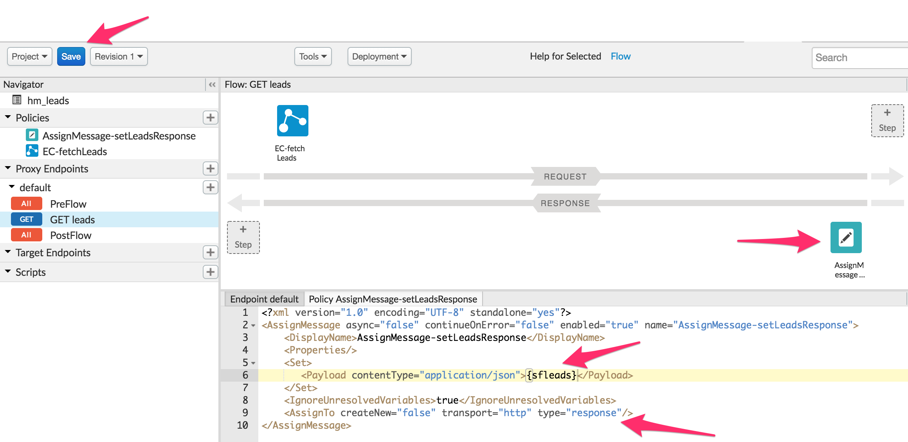

# Lab 2 - Using the Data Loss Prevention Extension

*Duration : 20 mins*

*Persona : API Team*

# Use case

You have a requirement to create a reverse proxy for taking requests from the Internet to retrieve employee information from a backend database and return employee data based on employee id. However certain employee information like employee phone number must be redacted before being returned to the calling application.

# How can Apigee Edge help?

Apigee Edge enables you to quickly expose backend services or workflows as APIs. You do this by creating an API proxy that provides a facade for the backend service or data that you want to expose.

The API proxy decouples your backend service implementation from the API that developers consume. This shields developers from future changes to your backend services. As you update backend services, developers, insulated from those changes, can continue to call the API uninterrupted.

In this lab, we will see how to enhance the employees proxy developed in Lab 1, to return the employee data after processing it through Google's Data Loss Prevention API using an Apigee Extension.

# Pre-requisites

* GCP service account credentials
* (Optional) If you are using your own backend Firebase database, the url endpoint to that database
* Apigee Edge account and Organization provisioned on Apigee Cloud with *Extensions* enabled
* Org Admin credentials to the above Apigee Edge Organization
* [REST Client](https://apigee-rest-client.appspot.com/) on a browser window., or Postman

# Instructions

## Create and configure the Data Loss Prevention (DLP) Extension instance on Apigee Edge

In the next set of steps below you will create an instance of the DLP Extension, configure it, and deploy it to the Apigee Edge *Test* environment.

1. Login to the Apigee Edge Org as an Organization Administrator.

2. Select *Admin > Extensions* from the left navigation menu

This page displays the list of existing Extension instances previously created in your Org, if any. Click on the *Add Extension* button in the top right to create a new extension.

3. On the *New Extension* page, click on the *Google Data Loss Prevention* extension.
Enter a name and optional description for the Extension instance. Then, click Create.

4. On the Extension detail page, click the > to configure the instance for the corresponding Apigee environment. In this lab, we will configure the *dlp* extension instance for the *test* environment.

5. Clicking the > will popup a dialog where you enter the following information:

* select the latest extension version
* your GCP project id. you can get your GCP project id from the GCP console.

* Info types. Enter PHONE_NUMBER in uppercase
* your GCP service account credentials in json format

Click Save.

6. Once the configuration is saved, click on the Deploy button for the *test* environment. This will initiate deployment of the extension instance to the Apigee *test* environment.

7. Once the extension is successfully deployed, you should see a green check mark that says *Deployed*. This indicates that the extension is ready for use in an API proxy deployed to the same Apigee Edge environment.

*Congratulations!* ...You have now successfully configured and deployed an instance of the Data Loss Prevention Extension on Apigee Edge.

## Modify the Employees API proxy in Apigee Edge

8. Click on Develop > API Proxies from the left hand menu. This lists any existing API proxies in your Apigee Org. From the list of existing proxies, click the *employees* proxy to view it in the Develop editor. Click the Develop tab in the top right.

# Develop the GET /{employee-id} conditional flow
This operation will handle GET requests to the employees proxy to retrieve an employee record from the backend database.

# Update the Target Endpoint GET /{employee-id} conditional flow

9. In Target Endpoints > default, add a *Conditional* flow for the GET /{employee-id}, if it does not exist already.

10. Add a Javascript policy to this conditional flow's request to update the target url as shown.

* Edit the Javascript policy as shown to rewrite the *target.url* system variable to include the proxy.pathsuffix and .json postfix
* Click *Save* to save and deploy the API proxy

11. Next, for any employee record returned we need to redact the employee phone number. We will use the DLP extension previously configured. Since the DLP policy takes a string as input, we need to first flatten the json object returned from the backend, as well as escape the " character in the employee json.

You can do this using a JS policy in the Proxy Endpoints > default > GET /{employee-id} response conditional flow.

12. Add an Extension Callout policy to the Proxy Endpoints > default > GET /{employee-id} response conditional flow.
* In the policy popup, select the *Lab1dlp* instance previously created, then select the *deidentifyWithType* Action from the drop-down list. Apigee Edge automatically discovers all available workflows for this extension instance.

* Edit the policy to supply its input, which will be the *response.content* variable. Also, change the name of the output variable. This variable will contain the output of the extension after the DLP extension executes.
* Click Save to save and deploy the proxy.

13. Set the output of the API proxy as the content of the extension's output variable *text* attribute. To do this, add an *AssignMessage* policy to the response of the GET /{employee-id} conditional flow. 

* Click on +Step button in the response flow, then select *AssignMessage* policy type in the popup dialog.

14. Edit the *AssignMessage* policy to remove the unused elements, set the payload content type, and content to come from the *{dlpEmployee.text}* variable, and set the *AssignTo* elements' type attribute to be *response*, as shown in the image below. Then, click Save to save and deploy the proxy changes.

*Congratulations!* ...You have now built a reverse proxy for an existing backend service to return data with sensitive information protected using the DLP extension.

## Test the API Proxy

1. Let us test the newly built API proxy. This proxy is a *passthru* proxy since it does not have any Apigee policies configured yet. We will add policies in subsequent labs. 
We will use the [REST Client](https://apigee-rest-client.appspot.com/). Open the REST Client on a new browser window.  You can also use other REST clients (eg. Postman) for testing.

2. Click on the *Trace* tab in the top right of the Developer editor in the Edge UI.

3. Click on the green *Start Trace Session* to start a trace session for your proxy.

4. Paste the http://{your-org}-test.apigee.net/v1/employees/{empid} link into the REST Client to make a GET call, and observe the request/response in the Trace window of the Apigee Edge UI.

5. You should see a success response similar to this -

# Summary

That completes this hands-on lesson. In this simple lab you learned:
* To create and deploy the Apigee Data Loss Prevention Extension
* Develop an API proxy to retrieve and protect sensitive information from the backend service by using Google's DLP API

# References

* [Google Cloud Data Loss Prevention Extension](https://docs.apigee.com/api-platform/reference/extensions/google-cloud-data-loss-prevention-extension)

