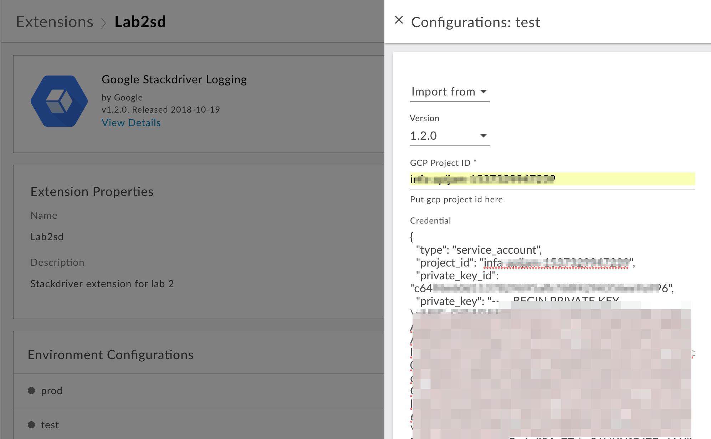

# Lab 2 - Using the Stackdriver Logging Extension

*Duration : 20 mins*

*Persona : API Team*

# Use case

Building on the API proxy developed in Lab 1, you now have a requirement to accept a POST request to your proxy inorder to create a new employee record in the backend database. As part of this requirement, the security and audit team within the organization mandates that all successful employee creation requests must be logged to an external system for audit and tracking purposes.

# How can Apigee Edge help?

Apigee Edge enables you to quickly expose backend services or workflows as APIs. You do this by creating an API proxy that provides a facade for the backend service or data that you want to expose.

The API proxy decouples your backend service implementation from the API that developers consume. This shields developers from future changes to your backend services. As you update backend services, developers, insulated from those changes, can continue to call the API uninterrupted.

In this lab, we will see how to enhance our employees proxy to create employee records in our backend database. As part of a successful request/response, an audit record is logged to Stackdriver using the Apigee Stackdriver extension.

# Pre-requisites

* GCP service account credentials
* (Optional) If you are using your own backend Firebase database, the url endpoint to that database
* Apigee Edge account and Organization provisioned on Apigee Cloud with *Extensions* enabled
* Org Admin credentials to the above Apigee Edge Organization
* [REST Client](https://apigee-rest-client.appspot.com/) on a browser window., or Postman

# Instructions

## Create and configure the Stackdriver Extension instance on Apigee Edge

In the next set of steps below you will create an instance of the Stackdriver Extension, configure it, and deploy it to the Apigee Edge *Test* environment.

1. Login to the Apigee Edge Org as an Organization Administrator.

2. Select *Admin > Extensions* from the left navigation menu

This page displays the list of existing Extension instances previously created in your Org, if any. Click on the *Add Extension* button in the top right to create a new extension.

3. On the *New Extension* page, click on the *Google Stackdriver Logging* extension.
Enter a name and optional description for the Extension instance. Then, click Create.

4. On the Extension detail page, click the > to configure the instance for the corresponding Apigee environment. In this lab, we will configure the *stackdriver* extension instance for the *test* environment.

5. Clicking the > will popup a dialog where you enter the following information:

* select the latest extension version
* your GCP project id. you can get your GCP project id from the GCP console.

* Copy/paste your GCP service account json file into the *Credential* field.
* If yo

Click Save.

6. Once the configuration is saved, click on the Deploy button for the *test* environment. This will initiate deployment of the extension instance to the Apigee *test* environment.

7. Once the extension is successfully deployed, you should see a green check mark that says *Deployed*. This indicates that the extension is ready for use in an API proxy deployed to the same Apigee Edge environment.

*Congratulations!* ...You have now successfully configured and deployed an instance of the Data Loss Prevention Extension on Apigee Edge.

## Modify the Employees API proxy in Apigee Edge

In this set of steps, you will modify the employees API in Apigee Edge to make use of the Stackdriver Extension previously configured and deployed in the Edge *test* environment.

8. Click on Develop > API Proxies from the left hand menu. This lists any existing API proxies in your Apigee Org. From the list of existing proxies, click the employees proxy to view it in the Develop editor. Click the Develop tab in the top right.

9. Develop the Proxy Endpoint > default > /POST conditional flow in the left nav menu. 
This operation will handle POST requests to the employees proxy that will create new employee records in the backend database.

In this flow, we first extract certain information from the request payload into flow variables, which we will use to construct the log message to be logged in Stackdriver.

* Attach an *ExtractVariables* policy to the /POST conditional flow, and modify it as shown to extract the employee name, email, department into 3 separate flow variables using *employee* as the variable name prefix. Click Save to save the proxy.

10. Next, add a Javascript policy to construct the log message using these flow variables in addition to the current timestamp. We also use the same policy to augment the input data with system generated fields. Save the proxy.

11. Once a successful response is received from the target, we then log the message to Stackdriver. To do this, we add an ExtensionCallout policy that references the Stackdriver extension previously configured in the Proxy Endpoint > default > /POST conditional flow response.

12. Update the ExtensionCallout policy to use the logMessage flow variable created by the JS policy in the earlier step.

* Modify the policy to supply the name of the log, project_id metadata, and the logMessage variable containing the log message string.
* Save and deploy the proxy.

## Testing the API 

1. Let us test the updated API proxy.
We will use the [REST Client](https://apigee-rest-client.appspot.com/). Open the REST Client on a new browser window.  You can also use other REST clients (eg. Postman) for testing.

2. Enter the proxy endpoint URL to fetch all employees into the REST Client to make a GET call, and observe the request/response
Method: POST
URL: https://{your-edge-org}-test.apigee.net/v1/employees

Header: Content-Type: application/json

NOTE: Change the values of the attributes in the json payload below:
Payload:
{
    "birthDate": "07-29",
    "city": "Dade City",
    "department": "Human Resources",
    "email": "robert@inquala.com",
    "gender": "male",
    "isActive": true,
    "name": "Robert Johnson",
    "phone": "+1 (801) 480-3114",
    "postal": "33525",
    "state": "FL",
    "street": "14129 Paradise Street"
}

3. You should see a success response similar to this -

4. Verify the log message in Stackdriver in the GCP console

* Navigate to the Stackdriver > Logging > Logs menu in the GCP console from the left hand  top icon (3 lines)

* On the logs page, select the Global resource
* View the log entries

# Summary

That completes this hands-on lesson. In this simple lab you learned:
* To create and deploy the Stackdriver Logging Extension
* Develop an API proxy to POST a resource to the backend and log a message to Stackdriver on GCP

# References

* [Google Stackdriver Logging Extension] (https://docs.apigee.com/api-platform/reference/extensions/google-stackdriver-logging-extension)

